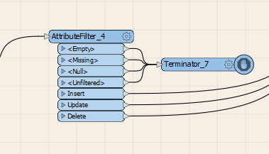

# Bonne Pratiques FME

Ce document contient une liste de bonne pratiques à utiliser lors de la conception de *Transformer* ou de *Custom Transformer*.  Le suivi de ces directives facilitera la maintenance du code en assurant un homogénéité du code écrit par les différents développeurs.

Ce document de bonne pratiques est en mode ébauche, les membres de l'équipe sont encouragés à développer de nouvelles *bonnes pratiques* ou bonifier des *bonne pratiques* qui seront partagées au sein de l'équipe et consignées dans le site web d'équipe.   

Ce document adresse les éléments de *bonnes pratiques* suivants:

 - [Documentation](#Documentation)
 - [Hardcoding](#Bookmark)
 - [Terminator](#Bookmark-imbriqué)
 - [Nom du transformer](#Nom-du-transformer)
 - [Gestion des attributs](#Gestion-des-attributs)

# Documentation

Toujours documenter les *transformer* et *custom transformer* avec la [procédure de documentation](Documentation%20FME.md) afin d'assurer une homogénéité dans le code en plus de maximiser sa lisibilité.
 

# Hardcoding

Le *hardcoding* est une pratique de développement logiciel où les données sont directement écrite dans le code.  Cette pratique tend à créer du code moins générique qu'il faut constamment modifier pour l'adapter à de nouvelles situations.  Le *hardcoding* est à éviter à tout prix.  L'utilisation de fichiers de configuration et de *publish parameters* est encouragée afin d'éviter les problèmes engendrés par le *hardcoding*.

C'est au développeur d'identifier les situations potentielles de *hardcoding* et de choisir la meilleure stratégie d'évitement.

# Terminator

Le *Terminator* est un *transformer* qui arrête l'exécution lorsqu'il est activé.  Il est utilisé généralement pour détecté des situations non valides.  Le *terminator* devrait toujours être utilisé dans le cas de *transformer* lorsqu'une situation inattendue survient mais aussi dans le cas de *transformer qui possède plusieurs ports de sortie qui ne devrait pas être utilisé. Dans ce cas les ports de sortie *non utilisés* devrait être relié à un *Terminator* de façon à déceler ces cas dans le code (voir figure ci-dessous).

Le *Terminator* offre aussi la possibilité d'affiché un texte lorsqu'il est activé.  Le texte devrait toujours être représentatif de la raison pourquoi le *Terminator* est activé (*Invalid attribute value for ID*) et évité les formalutation trop générique (*Translation failed...*)

# Nom du transformer

Toujours conserver le nom du *transformer* tel que donner par FME.  Si vous avez plus d'un *transformer* du même type dans votre *workbench* alors ajouter un suffixe (ex: _1, ou _2).  Conserver le nom du *transformer* original permet d'identifier plus rapidement le type de transformer employé.  Si un nom plus représentatif vous semble important alors privilégier une annotation sur le *transformer*. 

#Gestion des attributs
 

Le traitment des collection de métadonnées des différentes provinces contient plusieurs centaines d'attributs et de listes en plus de ceux qui sont créés par les différents   
*transformer*.  En plus de saturer le FME Data Inspector et de rendre plus difficile l'interprétation des résultats plus difficile, les attributs sont de grands consommateurs de ressources pour FME (mémoire et CPU).  Afin de mieux gérer les attributs doivent les *custom transformer* doivent:
  * Utiliser le *custom transformer* ATTRIBUTE_UNEXPOSER à la fin de l'exécution d'un *custom transformer* afin qu'aucun n'attribut ne soit exposé.
  * Utilisé le *transformer* *AttributeExposer* au début de votre *custom transformer* afin d'exposer uniquement les attributs nécessaires à votre traitement afin d'en faciliter la lecture, le débuggage et optimiser l'utilisation des ressources
  * Utiliser le *AttributeRemover* afin d'enlever tous les attributs temporaires et ceux qui ne sont plus utiles à votre traitement en aval afin d'en faciliter la lecture, le débuggage et optimiser l'utilisation des ressources